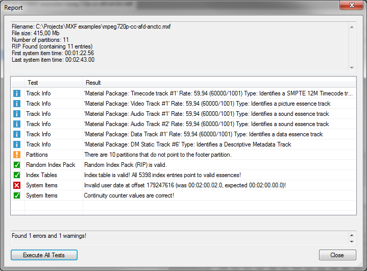
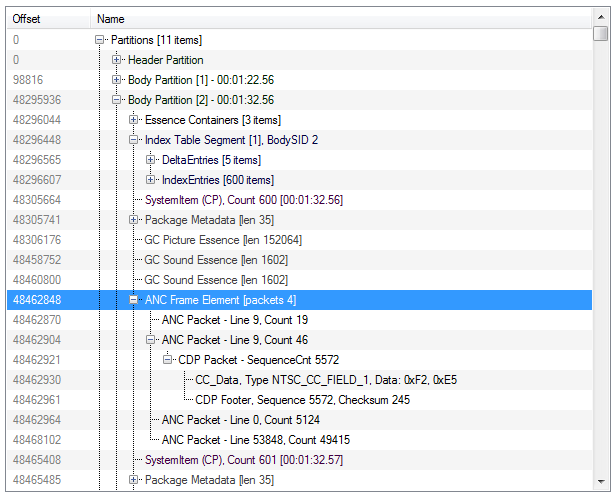

# Preface
This is a fork of the wonderful project [MXF Inspect](https://github.com/Myriadbits/MXFInspect) created by Jochem Bakker. Unfortunately he is not responding to merge requests anymore and the original project seems to be dead :cry:. This fork tries to keep the project alive, as I have implemented a couple of improvements w.r.t. the original.

**Improvements:**

- The MXF library project now uses .NET Standard 2.0, MXFInspect has been brought to .NET Framework 4.6.1
- Addition of new metadata classes (e.g. MPEGPictureEssenceDescriptor, JPEG2000PictureSubDescriptor). A hierarchical inheritance tree of MXF classes can be found [here](https://registry.smpte-ra.org/view/published/Groups_inheritance_tree.html). See this [TODO list](/tree.md) for the classes that still have to be implemented. 
- New MXF types (e.g. CodedContentScanningKind, ProductVersion, FrameLayout, Emphasis). A list of MXF types can be found [here](https://registry.smpte-ra.org/view/published/ul_hierarchy.html?rgr=t)
- Parsing of MXF File Version (e.g. 1.2, 1.3)
- Overall code improvement (using new C# language features)
  - use of region statements (e.g. for license preface in source files)
  - use of linq whenever possibile
  - gentle use of extension methods
  - fix typos, inconsistencies, doc
  - code base clean up (clean *.csproj file, remove unused files, polish .gitignore)

**Work in progress:**
- implementation of validators, that check whether a MXF file conforms to the [ARD ZDF profiles](https://www.irt.de/en/publications/technical-guidelines/technical-guidelines-download/mxf)
- drag and drop of MXF file in order to open it
- show data offset in hexadecimal
  
However, there is still a long **TODO list:**
- true MDI application, where multiple MXF files can be opened side-by-side
- pimp up the property grid (colors, hyperlinks for UMIDs)
- use a better control for the hex view 
- migrate code from using backgroundWorker to async/await
  - make file loading abortable (cancellable)
- optimize the MXFReader class to reduce file loading time
- reorganize the file check dialog
  - investigate on making tests hierarchical
  - add general file info dialog
  - add report (in xml) for conformance check
  - add checksum to file
- implement additional/more thorough file checks such as:
  - Is KAG Size consistent?
  - Is Edit Unit Size constant?
  - ...
- [Future Work](#Future-Work) of original project

**Any help/contribution is greatly appreciated!!!**

# MXF Inspect

MXF Inspect is a **fully functional and completely free** Windows tool to display the internal structure of a MXF (Material eXchange Format) file. It can NOT play the MXF movie itself. There is no demo and advanced mode, it is completely free. The application is tested on Windows 7, 8 and 10.

MXF files are extensively used in the broadcast industry. Since I was working in the broadcast industries, I personally used a lot of MXF files. I wanted to determine if certain MXF files were valid but could not find any good (free) tools on the internet so I decided to make my own. The source code is released under the GPL.

## Features
* Open multiple MXF files at once.
* View offsets, parsed MXF data and raw data in a glance.
* Offset and Logical view present.
* Jump to the next/previous object of the same type.
* Only show/filter the current object type.
* Show/hide fillers.
* Large file support. It is possible to load very huge MXF files (several Gigabyte) in seconds.
* 'Syntax‘ coloring. Different types of metadata can be given separate colors so it is easier to distinguish between the different types.
* Report screen that shows the results of the following tests:
	* Consistency of partitions (check if the previous/next partitions and footer partitions are filled in correctly)
	* RIP check (present and pointing to valid partitions)
	* Check if every entry in all index tables point to valid essences.
	* Test if the user dates in all system items (if present) increase correct (no jumps present).
	* Test continuity counter of the system items increases.

**This application does NOT implement the WHOLE SMPTE-MXF specifications. This program is distributed in the hope that it will be useful, but WITHOUT ANY WARRANTY; without even the implied warranty of MERCHANTABILITY or FITNESS FOR A PARTICULAR PURPOSE. See the GNU General Public License for more details.** 

## SMPTE
The MXF file specification is huge! The specification allows for a lot of different ‘tastes’ of MXF files. I started developing this application by using the SMPTE 377-1-2009 specifications only. But during development I realized that I needed to use a lot of other SMPTE specs as well. Some specifications are a bit unclear (at least to me). I don’t know if I understood/implemented them correctly which might result in a warning or error for some tests… The default label and key names found in SMPTE 377 are hardcoded into the MXF library, all other names are dynamically retrieved from the following SMPTE lists:

* SMPTE Metadata Dictionary as specified in RP210v13-2012
* SMPTE Labels Registry as specified in RP224v12-2012
* SMPTE Class 13 and Class 14 registrations list

## Screenshots

Some screenshots:

Report screen showing the new ‘Execute all tests’ button

Logical view

MXF file tree (with 'syntax' coloring)

## Future work
There are a number of features that require some work:

* Implement more tests in the report screen
* Improve the tracks information display in the report screen.
* Logical view should also include the logical track object hierarchy, maybe include the data itself.
* Ability to display the real subtitles information.
* Search and jump to a specific date/time/frame number.
* Search for text.

## Installation

Windows setup file of the 2.2.0.4 version can be downloaded on my website: [MXF Inspect](https://www.myriadbits.com/index.php/mxf-inspect-2/#)

Have fun!

*Jochem*
