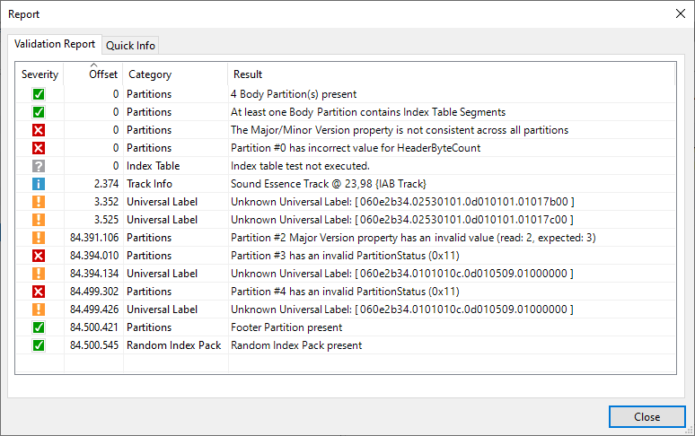
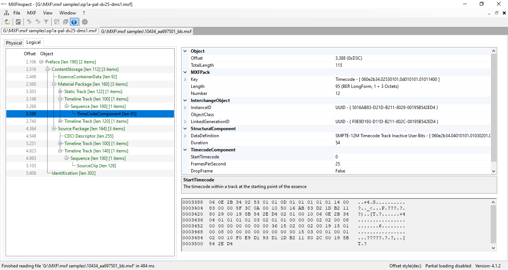
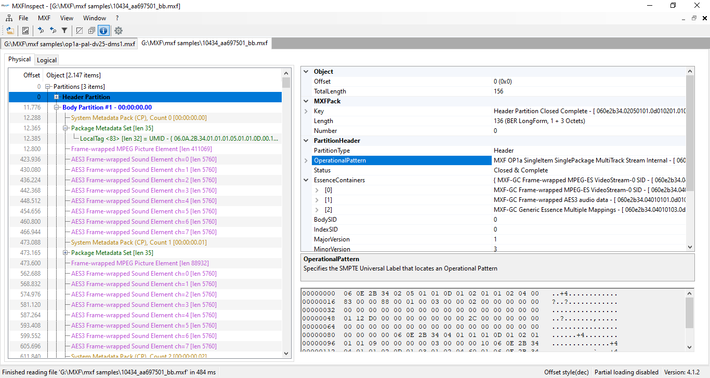
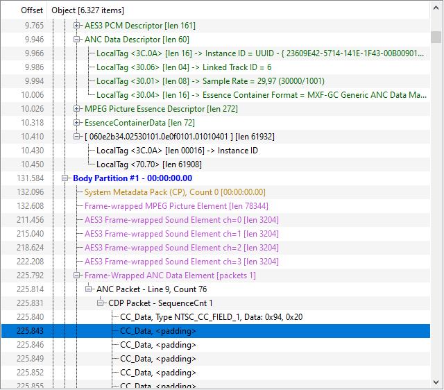
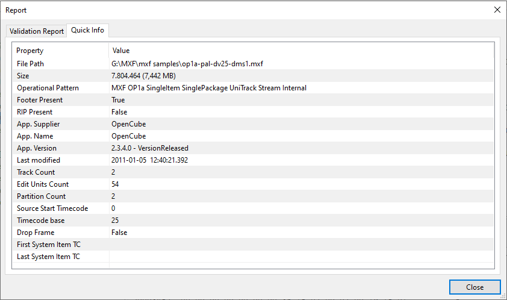

 

# MXF Inspect

MXF Inspect is a **fully functional and completely free** Windows tool to display the internal structure of a MXF (Material eXchange Format) file. It can NOT play the MXF movie itself. The application is tested on Windows 7, 8, 10 & 11.

MXF files are extensively used in the broadcast industry. Since I was working in the broadcast industries, I personally used a lot of MXF files. I wanted to determine if certain MXF files were valid but could not find any good (free) tools on the internet so I decided to make my own. The source code is released under the LGPL.

This project is updated in February 2023 by merging the rayden84 fork. This project now includes all changes that have been done in the rayden84 fork (<https://github.com/rayden84>). It includes code of the following contributors: feigenanton, rayden84, ft, ws, Nicolas Gaullier and Wolfgang Ruppel. They have made numerous updates and expanded the original project far beyond my original ideas. The original code has been totally revamped, clean-up, restructured, great work guys!

## MXF Inspect Features

* Open multiple MXF files at once.
* Support for different MXF File Version (e.g. 1.2, 1.3)
* Support for large number of MXF metadata packs, see this [TODO list](/tree.md) for the classes that are supported.
* View offsets, parsed MXF data and raw data in a glance.
* Physical (Offset) and Logical (Object hierarchy) view present.
* Jump to the next/previous object of the same type.
* Only show/filter the current object type.
* Written in .NET6. Thus allowing MXFInspect to be shipped as a single-file-application without any dependencies on installed .NET frameworks
* Large file support. It is possible to load very huge MXF files (several Gigabytes).
* 'Syntax' coloring. Different types of metadata can be given separate colors so it is easier to distinguish between the different types.
* Drag and drop of MXF file in order to open it
* Report screen that shows the results of the following tests/validators:
  * Consistency of partitions (check if the previous/next partitions and footer partitions are filled in correctly)
  * RIP check (present and pointing to valid partitions)
  * ~~Check if every entry in all index tables point to valid essences.~~ (Actually being reimplemented)
  * ~~Test if the user dates in all system items (if present) increase correct (no jumps present).~~ (Actually being reimplemented)
  * ~~Test continuity counter of the system items increases.~~ (Actually being reimplemented)

**This application does NOT (yet) implement the WHOLE SMPTE-MXF specifications. This program is distributed in the hope that it will be useful, but WITHOUT ANY WARRANTY; without even the implied warranty of MERCHANTABILITY or FITNESS FOR A PARTICULAR PURPOSE. See the Lesser GNU General Public License for more details.**

## Screenshots

*Validation report showing the "health status" of the MXF file*

*Logical view*

*Physical view*

*MXF Packs tree (with 'syntax' coloring, i.e. colorization based on MXF pack type)*

*Quick info*

**Latest improvements:**

* Further SMPTE Standards Implementation

  * New metadata classes (e.g. MPEGPictureEssenceDescriptor, JPEG2000PictureSubDescriptor). A hierarchical inheritance tree of MXF classes can be found [here](https://registry.smpte-ra.org/view/published/Groups_inheritance_tree.html). See this [TODO list](/tree.md) for the classes that still need to be implemented.
  * New MXF types (e.g. CodedContentScanningKind, ProductVersion, FrameLayout, Emphasis). A list of MXF types can be found [here](https://registry.smpte-ra.org/view/published/ul_hierarchy.html?rgr=t)
* Quick info panel added
* Basic logging functionality (see settings window...)
* Basic exception handling an of unparseable MXF packs

## Future work

However, there is still a long **TODO list:**

* implement additional/more thorough file checks/validations features such as:
  * Structurual validation (is KLV stream error-free?)
  * KAG (=Key alignment grid) validation
  * Essence validation
  * Metadata validation
  * add validation profiles, like [ARD ZDF profiles](https://www.irt.de/en/publications/technical-guidelines/technical-guidelines-download/mxf)
  * ability to export validation reports in various formats (txt, json, xml)
  * search for text in validation output
  * filter based on severity/error type
  
* User Interface
  * true MDI application, where multiple MXF files can be opened side-by-side
  * pimp up the property grid (colors, hyperlinks for UMIDs)
  * use a better control for the hex view, which makes use of colors for the various byte segments (e.g. this [HexViewer](https://github.com/themeldingwars/Be.HexEditor))
  * thumbnail preview of video essences (by using <https://github.com/cmxl/FFmpeg.NET> or <https://github.com/rosenbjerg/FFMpegCore>)
  * decoding of subtitles
  * "go to offset/go to pack number" navigation
  * in distant future migrate from Winforms to cross-platform UI like Electron.NET
  * optimize the MXFReader class to reduce file loading time
  * reorganize the file check dialog

* General
  * export/demux/remux essences
  * command-line-interface of MXF library for automated validation

* Long Term TODO
  * porting to NET.8
  * multi-platform-support (maybe by replacing winforms with [Electron.NET?](<https://github.com/ElectronNET/Electron.NET>)

**Any help/contribution is greatly appreciated!!!**

## Installation

Find the latest release and just download the self-contained single file for your Windows version, copy the zip contents to a separate folder and run the MXFInspect.exe.

**Have fun!**

*PS: The MXF file specification is huge! The specification allows for a lot of different ‘tastes’ of MXF files. I started developing this application by using the SMPTE 377-1-2009 specifications only. But during development I realized that I needed to use a lot of other SMPTE specs as well. Some specifications are a bit unclear (at least to me). I don’t know if I understood/implemented them correctly which might result in a possible incorrect warning or error for some tests…*
